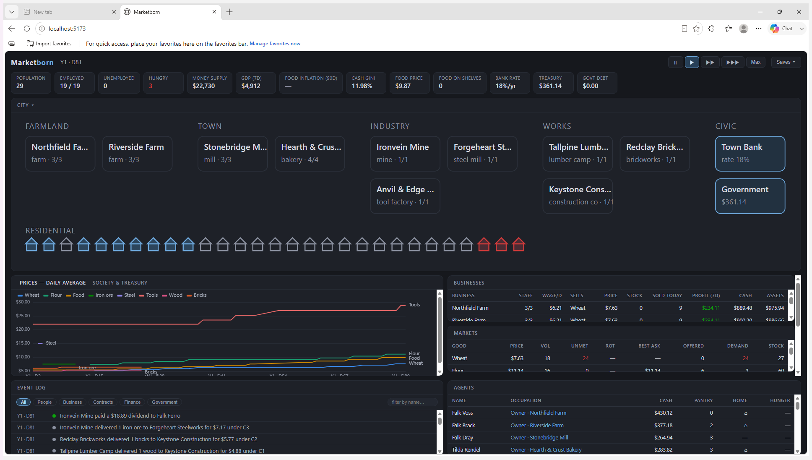

# Marketborn

A deterministic economic-agent strategy simulation for the desktop: a fictional
city-state of autonomous agents who work, trade, produce, borrow, gossip, save
and go hungry — observed and influenced (never commanded) by the player.
Tauri 2 + React/TypeScript UI over a pure-Rust simulation core with SQLite
persistence.



## What's in the box (v1.0)

- **Three production chains** (food, industry, construction), nine goods,
  tools as wearing capital, spoilage, posted-price markets with deterministic
  clearing.
- **An agent society**: nine personality traits per agent, a utility decision
  engine whose every choice is journaled with a plain-language explanation,
  memories that decay, seven-dimension private relationships, and reputation
  that spreads through workplace and neighborhood gossip.
- **Contracts and finance**: requirements-form supply contracts with a fully
  logged three-round price negotiation, breach and penalties, and a bank —
  credit assessment, working-capital loans, default → foreclosure →
  fire-sale.
- **Government and policy**: a born-broke treasury funded by a sales tax, a
  welfare floor, a minimum wage, sovereign debt at the bank's floating rate,
  and deterministic scenario shocks (drought). Policies have costs, tradeoffs
  and delayed effects — all of them emergent, none scripted.
- **Determinism as a contract**: same seed + config + command log ⇒ identical
  BLAKE3 state hashes and event sequences. Money is integer cents; every
  rounding remainder is explicitly assigned. Nine economic invariants run
  every tick in debug builds; `sim-cli diff` finds the first divergent tick
  between any two runs.
- **The full v1.0 screen set**: world overview with macro indicators, city
  map, agent/business/contract inspectors, market view, filterable event
  timeline, historical charts, a policy panel, named save slots with
  autosave, and speed controls.

## Quickstart

Prerequisites: Rust (pinned by `rust-toolchain.toml`), Node 20+, VS Build
Tools (Windows), WebView2 runtime.

```
npm --prefix app install     # first time only
npm run check                # quality gate: fmt, clippy, tests, tsc, vitest
npm run check:full           # + release soaks, property sweeps, Playwright E2E
npm run app:desktop          # build the frontend and launch the desktop app
npm run app:package          # NSIS installer → target/release/bundle/nsis/
```

Headless tools:

```
cargo run --release -p sim-cli -- run --seed 42 --ticks 3650    # a decade in ~0.1 s
cargo run --release -p sim-cli -- serve                          # websocket backend for the browser UI
cargo run --release -p sim-cli -- metrics <save> --csv out.csv   # per-day time series
cargo run --release -p sim-cli -- replay <save>                  # hash-verified re-run
cargo run --release -p sim-cli -- diff <a> <b>                   # first divergent tick
```

With `serve` running, `npm run app:dev` serves the same UI to a plain browser
at `http://localhost:5173`.

## Layout

- `crates/sim-core` — pure simulation logic (no I/O, no clock, no threads)
- `crates/sim-persist` — SQLite save/load/replay/event archive
- `crates/sim-cli` — headless runner: `run`, `replay`, `hash`, `diff`, `metrics`, `serve`
- `src-tauri` — thin desktop shell hosting the simulation thread
- `app` — React + Vite + TypeScript frontend (+ the Playwright E2E suite)
- `docs` — the project's binding documentation (start with `BRIEF.md`,
  `PLAN.md`, `PROGRESS.md`; every non-trivial decision is an ADR in
  `DECISIONS.md`)

`CLAUDE.md` is the project constitution — binding for every working session.
